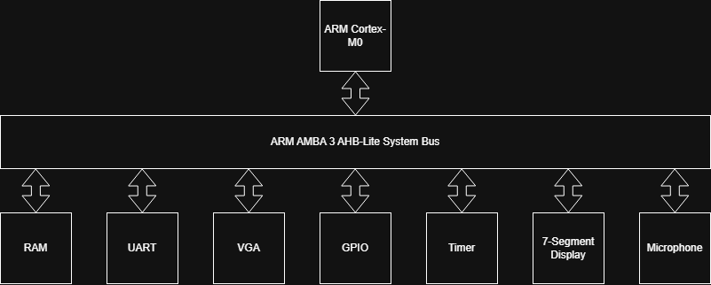

# Destroy the Boat!
A custom System-on-Chip (SoC) designed and implemented on a Xilinx Nexys A7 FPGA. The system integrates an ARM Cortex-M0 design_start core with an AHB-Lite bus matrix to host a real-time, two-player game featuring custom hardware peripherals, including a hardware-accelerated DSP microphone chain, VGA graphics, UART, and GPIO.

# The Game
Destroy The Boat! is a two-player PvP game where one player takes control of a boat and the other player controls cannons. The goal of the boat is to stay alive for as long as possible while collecting tokens to score points. The goal of the cannons is to destroy the boat and prevent it from accruing as many points as possible.

# System Architecture

# Hardware (Verilog, Vivado)
- Bus Architecture: Fully compliant AHB-Lite bus fabric utilizing Memory-Mapped I/O (MMIO) to decode addresses and route data between the Cortex-M0 master and custom peripheral slaves.

- Peripherals: 
    - BRAM: Stores the program for the processor to fect
    - VGA: Displays the game
    - UART: Takes in keyboard input to control a boat 
    - Timer: Keeps track of game time
    - GPIO: Controls switches that fire cannons
    - 7-segment Display: Displays the current game time

# Firmware and Software
The program was designed so that it can be very power efficient, making use of interrupts and sleep modes to conserve power as much as possible. The game was written in C, while an assembly file called cm0dsasm.s serves as a bridge between the C files and the hardware. 
- cm0dsasm.s holds the vector table, interrupt handlers, and allocates the stack and heap. 
- main.c implements the core game logic, taking an advantage of a simple API to control the game objects.
- edk_api.c holds the API. The API makes use of the CMSIS standard to enable and disable interrupts and handle interrupt priorities,
- edk_driver.c holds the hardware drivers that are written in bare-metal C. The game uses MMIO to read different peripherals, and perform some function with what they read. 

